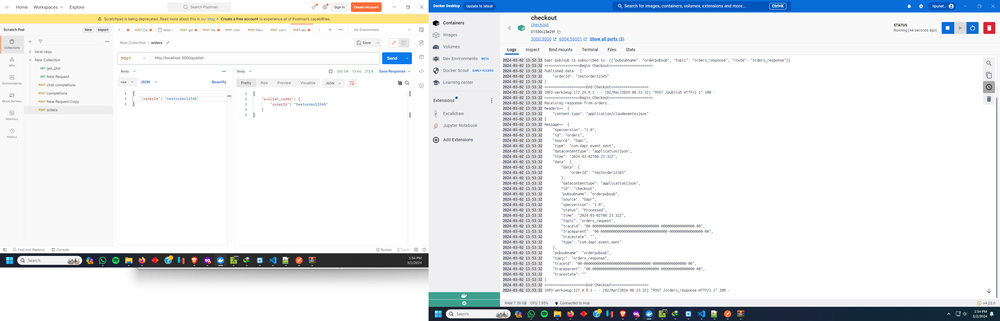

# Dapr pub/sub

## Background
This repo uses python flask based REST-API microservices, redis and dapr runtime to enable publish-subscribe pattern. I have included docker-compose in it to run it as full fledged app in the system including all components.

For more details about this quickstart example please see the [Pub-Sub Quickstart documentation](https://docs.dapr.io/getting-started/quickstarts/pubsub-quickstart/).

Visit [this](https://docs.dapr.io/developing-applications/building-blocks/pubsub/) link for more information about Dapr and Pub-Sub.


This quickstart includes one publisher:

- Python client message generator `checkout` 

And one subscriber: 
 
- Python subscriber `order-processor`

### Pre-requisites


- [Docker Desktop](https://www.docker.com/products/docker-desktop)
<!-- END_IGNORE -->

# Running using docker-compose

- A docker compose file is created to dockerize the checkout and order processing.  
Use below commands to run :-  
  - ```docker-compose build```  
  - ```docker-compose up```  

  Redis is used as message-broker, docker-compose will create all the containers including microservices and redis container.
- Send event using postman or by using python script.  

  - Using Postman.  
    Send below json in body of the message.

    ```json
    {
      "orderId": "anyorderid"
    } 
    ```
  - Using curl
    ```curl
    curl --location 'http://localhost:3000/publish' \
      --header 'Content-Type: application/json' \
      --data '{
          "orderId": "testorder12345"
      }'
    ```

- Sample output
  

# Reference links

https://docs.dapr.io/getting-started/  
https://docs.dapr.io/getting-started/quickstarts/pubsub-quickstart/  
https://docs.dapr.io/developing-applications/building-blocks/bindings/howto-triggers/  

